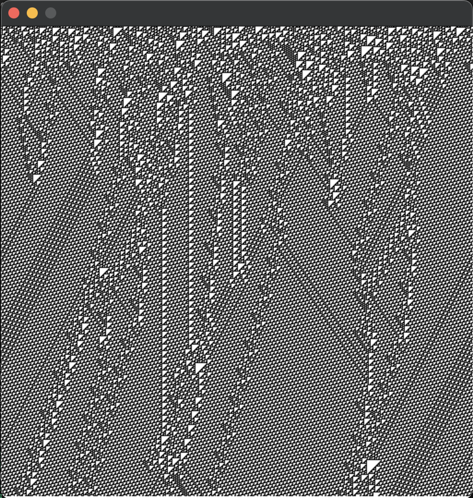

# LLVM Course

## GUI Application
This is simple implementation for cellular automaton using SDL2 (wrapped with API). [Here](https://en.wikipedia.org/wiki/Cellular_automaton) you can read more about this interesting phenomena.



## Build
To build program:
```
        git clone https://github.com/kefirRzevo/LLVM-course.git
        cd LLVM-course
        cmake -S . -B build
        cmake --build build
```
To run program:
```
    ./build/gui-app/MyGUI
```

## LLVM-IR
To generate LLVM-IR do this:
```
cd gui-app/llvm-ir
clang-18 -std=c23 -emit-llvm -S ../src/Application.c ../src/Start.c -I ../include
```
